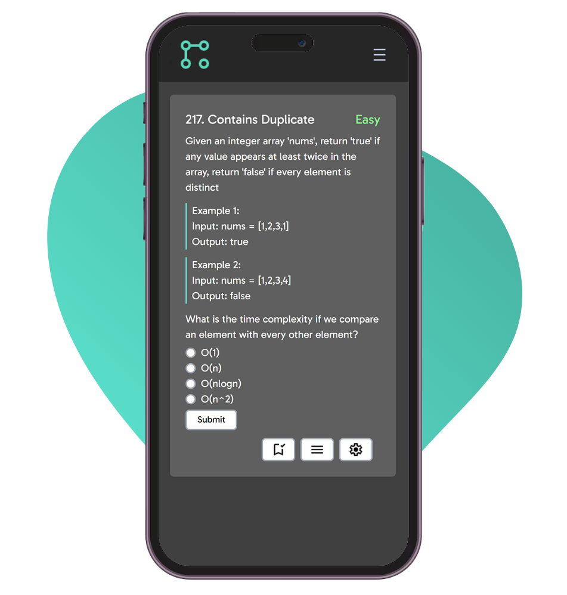

    
    <h1>AlgoQuiz</h1>
    
Algorithm & Data Structures Quiz App

## 👨‍💻 What is AlgoQuiz?

AlgoQuiz is a platform designed to help you prepare for technical interviews by offering a comprehensive set of questions and resources related to Algorithms and Data Structures.

## ✨ Features

- **Hosted on AWS Amplify:** The app is hosted on AWS Amplify, ensuring reliable uptime and performance.
- **Comprehensive Question Database:** AlgoQuiz features a vast database of questions covering various topics in Algorithms and Data Structures.
- **Google OAuth Integration:** Users can easily sign in using their Google accounts, providing a seamless and secure authentication experience.
- **User Progress Tracking:** The app tracks and saves the questions that users have completed or saved for future reference, allowing users to easily monitor their progress and revisit challenging questions.

## ⚙️ Getting Started

1. Clone the respository: `git clone https://github.com/tonytwei/algoquiz.git`
2. Install dependencies: `npm install`
3. Run the development server: `npm run dev`

This is a [Next.js](https://nextjs.org/) project bootstrapped with [`create-next-app`](https://github.com/vercel/next.js/tree/canary/packages/create-next-app)

## 💻 Technologies Used

- **React:** The UI of AlgoQuiz is built with React, providing a responsive and interactive user experience.
- **Tailwind CSS:** Tailwind CSS is used for styling the application, allowing for a highly customizable and modern design.
- **Next.js:** Next.js is used for server-side rendering, improving the performance and SEO of the application.
- **MongoDB:** MongoDB is used as the database for storing the questions and user data.
- **TypeScript:** TypeScript is used for static typing, improving the reliability and maintainability of the code.
- **AWS Amplify:** The app is hosted on AWS Amplify, providing a scalable and reliable hosting solution.

## 📸 Screenshots

## 🧾 License

MIT license @ tonytwei
