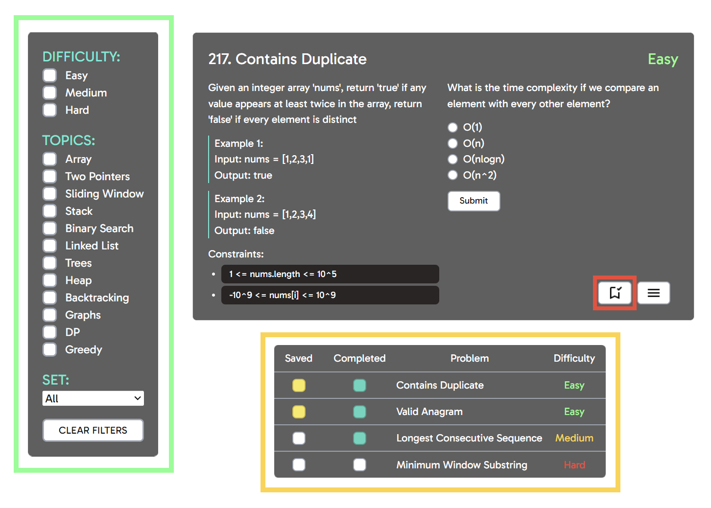

# AlgoQuiz
AlgoQuiz is a platform designed to help you prepare for technical interviews by offering a comprehensive set of questions and resources related to Algorithms and Data Structures.

## Features

- **Question Database:** AlgoQuiz features a database of questions covering various topics in Algorithms and Data Structures.
- **Google OAuth Integration:** Users can easily sign in using their Google accounts, providing a seamless and secure authentication experience.
- **User Progress Tracking:** The app tracks and saves the questions that users have completed or saved for future reference, allowing users to easily monitor their progress and revisit challenging questions.

## Getting Started

1. Clone the respository: `git clone https://github.com/tonytwei/algoquiz.git`
2. Install dependencies: `npm install`
3. Run the development server: `npm run dev`

## Technologies Used

**Frontend:** React with Typescript
**Styling:** Tailwind CSS
**Backend:** Next.js framework
**Database:** MongoDB
Hosted via AWS Amplify

## Project Preview

## License

MIT license @ tonytwei
